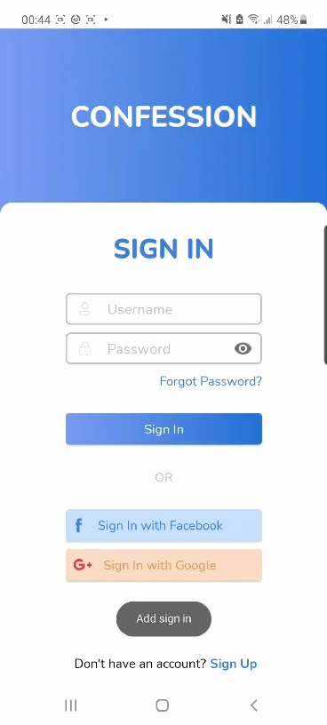
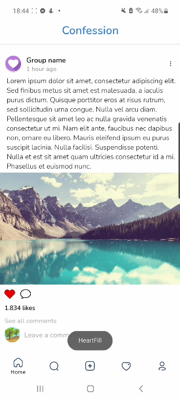
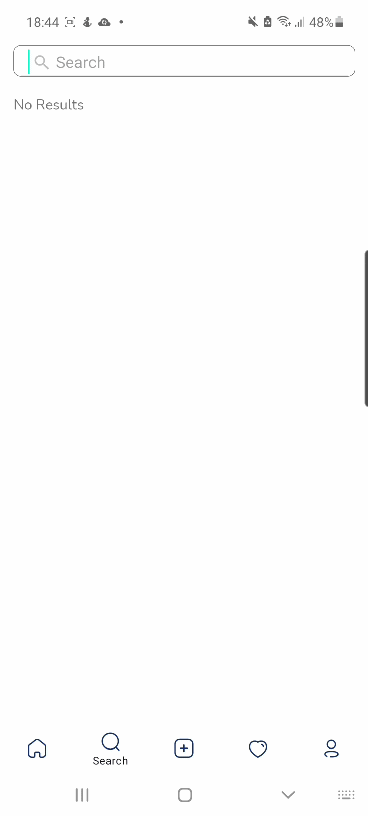

<h1 align="center">Confession (Android Application)</h1>

<div align="center">

<a href="https://github.com/NickMark028/Confession/stargazers"></a>
<a href="https://github.com/NickMark028/Confession/network/members"></a>
<a href="https://github.com/NickMark028/Confession/issues"></a>
<a href="https://github.com/NickMark028/Confession/graphs/contributors"></a>
<a href="https://github.com/NickMark028/Confession/blob/master/LICENSE"></a>

<div style="display: flex; flex-direction:row; justify-content: space-between; ">
    
  
  
</div>
</div>

<!-- TABLE OF CONTENTS -->
<h3 align="center"> TABLE OF CONTENTS </h3>
<details open="open">
  <summary>Contents</summary>
  <ol>
    <li>
      <a href="#about-the-project">About The Project</a>
      <ul>
        <li><a href="#built-with">Built With</a></li>
      </ul>
    </li>
    <li>
      <a href="#installation">Installation</a>
    </li>
   <li><a href="#contributor">Contributor</a></li>
   <li><a href="#contact">Contact</a></li>
  
  </ol>
</details>

<!-- ABOUT THE PROJECT -->
## About The Project

In this project, we will make an android application about Confession topic.

Why we do this:
* We want to create a secret environment for everyone to join us and share their own story about their life or something else.
* We also do this project for our subject (Mobile Application Developement) in our university (University of Science - Dai Hoc Khoa hoc Tu nhien) 

### Built With

<code>Android Native/Java</code>

<!-- INSTALLATION -->
## Installation

Clone this repository and import into Android Studio
   ```sh
   git clone https://github.com/NickMark028/Confession.git
   ```

<!-- CONTRIBUTOR -->
## Contributor
<a href="https://github.com/NickMark028/Confession/graphs/contributors">
  
</a>


<!-- CONTACT -->
## Contact 
* Truong Quoc An - tqan.work@gmail.com
* Truong Bao Khiem - nickmark028@gmail.com
* Nguyen Thanh Phong - tphong171@gmail.com
* Vu Cong Thanh - vcthanh2901@gmail.com


